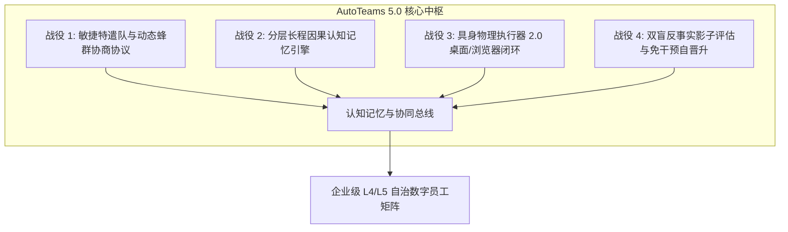

# AutoTeams 5.0 演进蓝图与全自主蜂群架构设计

> 文档版本：5.0.0-PROPOSAL  
> 制定日期：2026-09-26  
> 责任角色：AutoTeams 主架构师（Master Orchestrator）  
> 基线状态：AutoTeams 4.0（Phase 1–5 后端 100% 绿灯，Screens 01–11 克制·编辑式高阶 UI 全量合入）  
> 约束原则：绝对净室设计（Clean Room Design），0 竞品代码引入，全仓与提交记录绝对零竞品商标或商业代号。

---

## 一、 执行摘要与 5.0 北极星目标

### 1.1 演进背景与代际跨越
AutoTeams 4.0 成功完成了**企业数字资产编译器、SOP 流程引擎、竞标扣血协作网络、全渠道消息网关、MCP 端侧执行器**以及**克制·编辑式 11 屏工业级前端 UI**的建设。平台已具备了企业级数字员工“上岗、协作、考核、接入”的坚实基础。

然而，面对真实企业复杂、瞬变与多变的业务环境，4.0 仍存在明显的代际局限：
1. **组织形态静态化**：部门编制与岗位权责属于预先配置，面对突发重大事件或复合型大任务时，无法动态拉起跨领域精锐专项组；
2. **长程协作遗忘**：员工跨天、跨会话协作时，缺乏长程因果剧集记忆，无法持续从历史协作失败与成功中提炼规程基因；
3. **物理执行边界受限**：端侧执行器主要依赖命令行工具与标准 API，面对无开放 API 的企业老旧 ERP/CRM/办公软件缺乏具身操控能力；
4. **影子考核弱因果**：实习转正主要依赖事后人工抽检与基础文本相似度比对，缺乏真正的反事实差分因果推演。

### 1.2 AutoTeams 5.0 北极星愿景（The North Star）
> **从 4.0 的「数字员工被动接单与规则流程编排」跨越到 5.0 的「全自主敏捷特遣蜂群编队、长程因果认知记忆与端侧物理具身闭环的 L4/L5 级自主演进超级组织（Autonomous Enterprise Swarm）」。**



---

## 二、 4.0 已交付基线事实（Baseline Audit）

| 层次 / 模块 | 核心能力基线 | 现状与交付证据 |
| :--- | :--- | :--- |
| **Phase 1: 组织模型** | `DigitalEmployee` 模型、Fernet 加密凭证机、`SafeHarness` 沙箱 | 后端通过，测试 `test_workforce_profile.py` 绿灯 |
| **Phase 2: 规程引擎** | Flow-Core 工业级 SOP 状态机、Tri-Rule 三重安全护栏、自适应插槽分派 | 后端通过，测试 `test_flow_core.py` 绿灯 |
| **Phase 3: 协同网络** | Team-Matrix 协同网络、三轮竞标裁决协议、动态 HP 扣血淘汰、共享黑板 | 后端通过，测试 `test_team_matrix.py` 绿灯 |
| **Phase 4: 全渠道接入**| 企业微信/飞书适配器、防重放去重缓存、SOP 保护期灰度发布窗口 | 后端通过，测试 `test_omnichannel.py` 绿灯 |
| **Phase 5: 端侧与进化**| 标准 MCP 客户端（stdio/sse）、Local Runner 物理桥接、全员进化飞轮 | 后端通过，测试 `test_mcp_evolution.py` 绿灯 |
| **前端 UI 4.0** | 11 屏单文件原型已全量重构落地（01驾驶舱至11组织进化），对齐克制·编辑式美学 | `npm run build` 5454 模块编译 0 错误，Commit `e20ed8b` |

---

## 三、 AutoTeams 5.0 四大核心架构战役深度技术规格

### 战役 1：敏捷特遣队与蜂群自治协商协议（Dynamic Strike Teams & Contract Net Protocol 2.0）

#### 1. 业务价值
打破静态组织结构。数字员工在感知到复杂大任务或系统瓶颈时，能自主发起组队、拆解子任务，并通过 Contract Net Protocol 2.0 向其他在岗或空闲员工发起带资竞标，临时锁定资源租约并在共享黑板协作，任务闭环后自动清算并解散。

#### 2. 数据模型设计
```python
# backend/app/models/strike_team.py
from datetime import datetime
from sqlalchemy import Column, String, Integer, Float, DateTime, JSON, Text, Enum
from app.db.base import Base
import enum

class StrikeTeamStatus(str, enum.Enum):
    FORMING = "forming"         # 组建与竞标中
    ACTIVE = "active"           # 执行中（资源租约生效）
    REVIEWING = "reviewing"     # 成果验收与对齐
    DISSOLVED = "dissolved"     # 任务闭环，特遣队注销

class StrikeTeam(Base):
    __tablename__ = "strike_teams"
    
    id = Column(String(48), primary_key=True, index=True)
    enterprise_id = Column(String(48), nullable=False, index=True)
    name = Column(String(128), nullable=False)                  # 特遣队代号（如：Alpha-01-海关报关突击队）
    mission_statement = Column(Text, nullable=False)            # 核心使命与验收标准
    initiator_badge = Column(String(48), nullable=False)        # 发起员工工号（如：ATE-2026-SALES-001）
    status = Column(String(24), default=StrikeTeamStatus.FORMING.value, nullable=False)
    
    # 资源租约与经济模型
    allocated_compute_budget = Column(Float, default=100.0)     # 算力配额（点数/金额）
    total_hp_stake = Column(Float, default=0.0)                 # 全队 HP 抵押池（对赌机制）
    shared_blackboard_id = Column(String(48), nullable=False)   # 关联黑板 ID
    
    # 成员清单与角色分工
    members = Column(JSON, default=list)                        # List[{badge, role, stake_hp, joined_at}]
    subtask_graph = Column(JSON, default=dict)                  # 动态 DAG 子任务依赖图
    
    created_at = Column(DateTime, default=datetime.utcnow)
    expires_at = Column(DateTime, nullable=True)               # 租约到期强制解散时间
```

#### 3. 核心 API 端点契约
- `POST /api/v1/strike_teams`：发起特遣队招募
- `GET /api/v1/strike_teams`：查询活动特遣队列表与成员状态
- `POST /api/v1/strike_teams/{team_id}/bid`：其他员工带资响应竞标
- `POST /api/v1/strike_teams/{team_id}/dissolve`：任务交付验收并清算解散

---

### 战役 2：全模态分层长程认知记忆中枢（Episodic-Procedural-Semantic Cognitive Memory Core）

#### 1. 业务价值
打破会话级遗忘。解决长周期任务因上下文截断导致的协同动作偏离与历史错误重犯。

#### 2. 三层记忆存储架构
```
┌────────────────────────────────────────────────────────┐
│             Layer 3: Procedural Memory (规程记忆)       │
│  - 经 SOPSynthesizer 蒸馏出的最佳协作模式与自愈规程卡    │
├────────────────────────────────────────────────────────┤
│             Layer 2: Semantic Graph (语义实体记忆)      │
│  - 实体/关系图谱（客户、项目、合规条款、组织禁令）      │
├────────────────────────────────────────────────────────┤
│             Layer 1: Episodic Traces (情景剧集记忆)     │
│  - 协作时间序列快照、因果链条（Caused-By）、反思与修正  │
└────────────────────────────────────────────────────────┘
```

#### 3. 核心接口与混合检索管道
```python
# backend/app/services/memory/cognitive_core.py
class CognitiveMemoryCore:
    async def record_episodic_trace(self, enterprise_id: str, badge: str, event_trace: dict):
        """记录情景因果链轨迹"""
        ...
        
    async def query_hybrid_memory(self, enterprise_id: str, query: str, context_tags: list[str]) -> list[MemoryResult]:
        """
        三路混合检索：
        1. Dense Vector (ChromaDB / Qdrant 语义相似度召回)
        2. Sparse BM25 (精准关键字与错误码匹配)
        3. Multi-hop Graph Traversal (知识图谱多跳因果推理)
        """
        ...
        
    async def consolidate_procedural_memory(self, enterprise_id: str):
        """定期记忆沉淀：将过去 N 次高绩效任务提炼为规程卡经验基因"""
        ...
```

---

### 战役 3：具身物理执行器 2.0（Local Runner 2.0: Headless Browser & Desktop Automation）

#### 1. 业务价值
使数字员工走出纯 API 环境，直接在端侧（员工本地机或安全受控主机）自动化操作没有公开 API 的企业内部老系统（如 SAP、内部 OA、本地设计工具）。

#### 2. 技术规格与架构
1. **内核升级**：`autoteams-runner` 集成无头 Chromium（Playwright/CDP）与操作系统原生辅助功能树（Accessibility Tree / UIAutomation）；
2. **物理沙箱阻断**：所有点击、键入与跨窗口操作由 Tri-Rule Guardrails 实时审查：
   - 严禁输入硬编码密码与敏感凭据（强制走 Fernet 凭据机代填）；
   - 高危操作（如转账确认、批量删除）强制暂停并推送端侧物理双因子确认通知；
3. **实时视窗流**：端侧将操作视窗以极低带宽编码为无损灰度图帧或关键帧变化日志，流式回传至前端。

---

### 战役 4：双盲反事实影子评估与免干预自晋升（Dual-Blind Counterfactual Shadowing 2.0）

#### 1. 业务价值
在完全不影响人类正常业务的前提下，对处于考核期的实习数字员工进行全仿真对比，并基于反事实推演评估预期收益与潜在风险。

#### 2. 反事实差分评测机设计
```python
# backend/app/services/shadow/counterfactual_evaluator.py
class CounterfactualEvaluator:
    async def evaluate_turn(
        self, 
        human_action: dict, 
        agent_proposal: dict, 
        task_context: dict
    ) -> CounterfactualReport:
        """
        计算反事实差分：
        - 语义意图一致性（Semantic Alignment Score）
        - 预估耗时对比（Time Saving Margin）
        - 预估 Token/算力成本（Cost Profile）
        - 风险与护栏违背度（Guardrail Breach Risk）
        """
        ...
        
    async def check_auto_promotion(self, badge: str) -> bool:
        """
        免干预转正裁决：
        - 连续 50 次业务对齐度 ≥ 96%
        - 0 次严重合规或护栏违规
        - 触发自动晋升：工号由 ATE-INTERN- 升级为 ATE-正式工号，并自动签署授权协议
        """
        ...
```

---

## 四、 AutoTeams 5.0 实施与调度计划（4 路并发 Worktree 架构）

延续 4.0 验证极度成功的研发组织范式：

```
[Main 控制台 / 主架构师 (当前会话 / gemini-3.8-flash:high)]
   ├── WT1: wt-strike-teams (战役 1: 敏捷特遣队与动态蜂群协商协议)
   ├── WT2: wt-cognitive-memory (战役 2: 分层长程因果认知记忆中枢)
   ├── WT3: wt-local-runner-v2 (战役 3: 具身物理执行器 2.0)
   └── WT4: wt-shadow-counterfactual (战役 4: 双盲反事实影子评估与免干预自晋升)
```

| 阶段 | 周期/步骤 | 核心交付目标 | 验收证据 |
| :--- | :--- | :--- | :--- |
| **阶段 1** | 工作树与分支初始化 | 创建 4 个物理隔离 Worktree，映射依赖并验证基线 | 4 个 Worktree 均 `git status` 洁净并编译通过 |
| **阶段 2** | 并行后端与前端开发 | 各路 Agent 按上述技术规格独立编写后端路由与前端界面 | 各 Worktree 内 pytest 与 npm run build 0 错误 |
| **阶段 3** | 主架构师高阶审查 | 主架构师接管关键算法，审查 Clean Room 规范与接口契约 | 审查报告出炉，消除逻辑死锁与安全隐患 |
| **阶段 4** | 顺序合流与全量回归 | 按依赖顺序将 4 条分支合入 `main`，执行全套回归测试 | 50+ 后端测试绿灯，全站 5400+ 模块编译 0 错误 |

---

## 五、 确认与启动指令

本蓝图已正式固化至代码仓库 `docs/AutoTeams-5.0演进蓝图与全自主蜂群架构设计.md`。

请您审阅本方案。一旦您发出启动指令，主架构师将立即初始化 4 个 5.0 工作树并派发任务！
