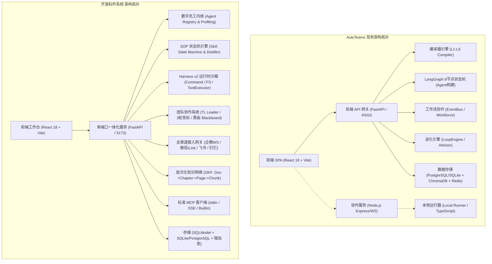
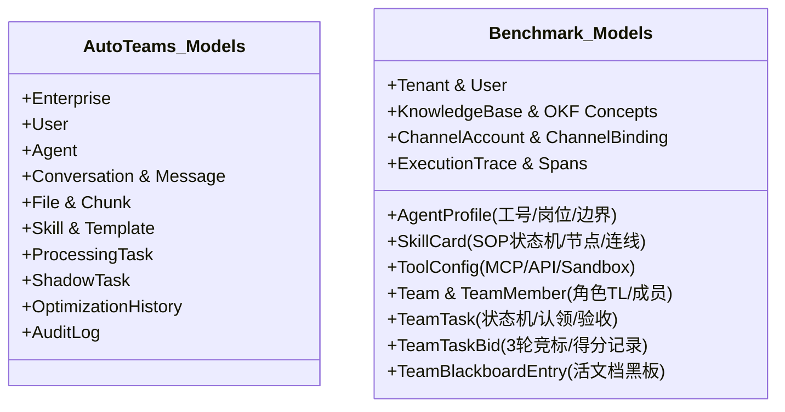
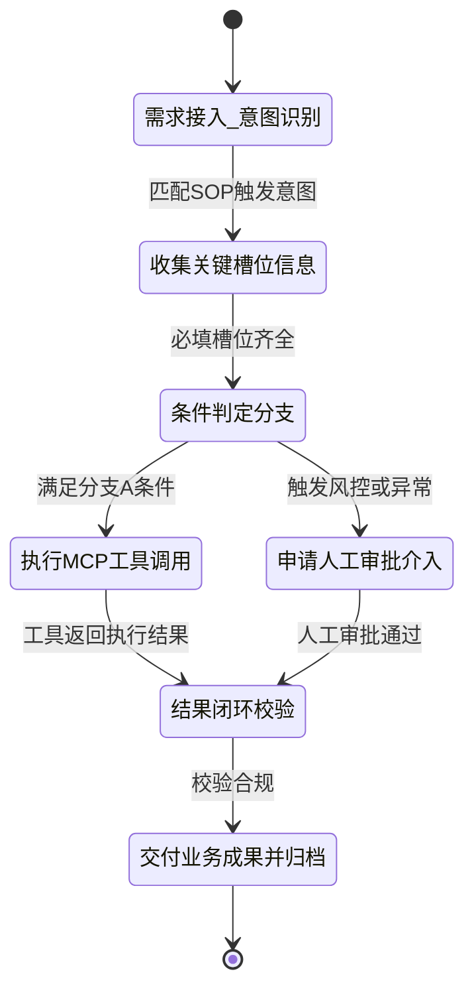
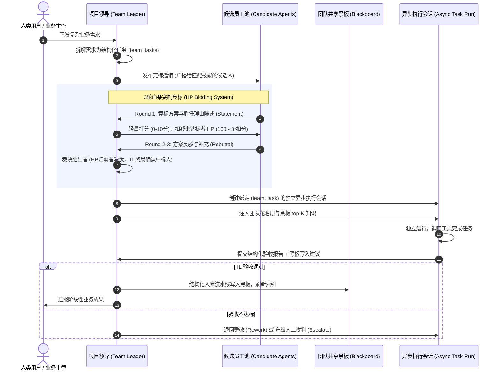
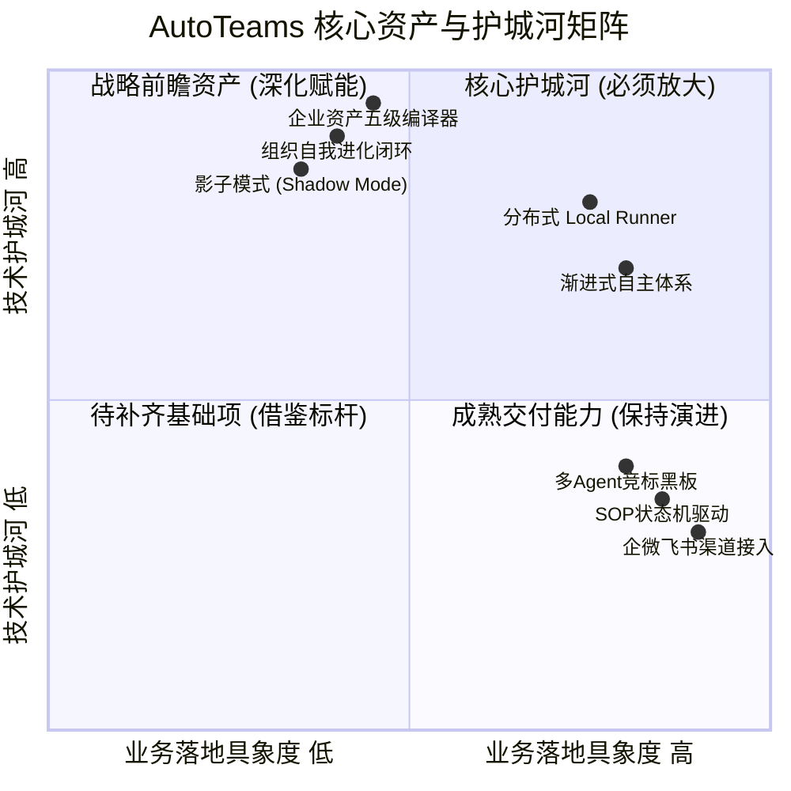
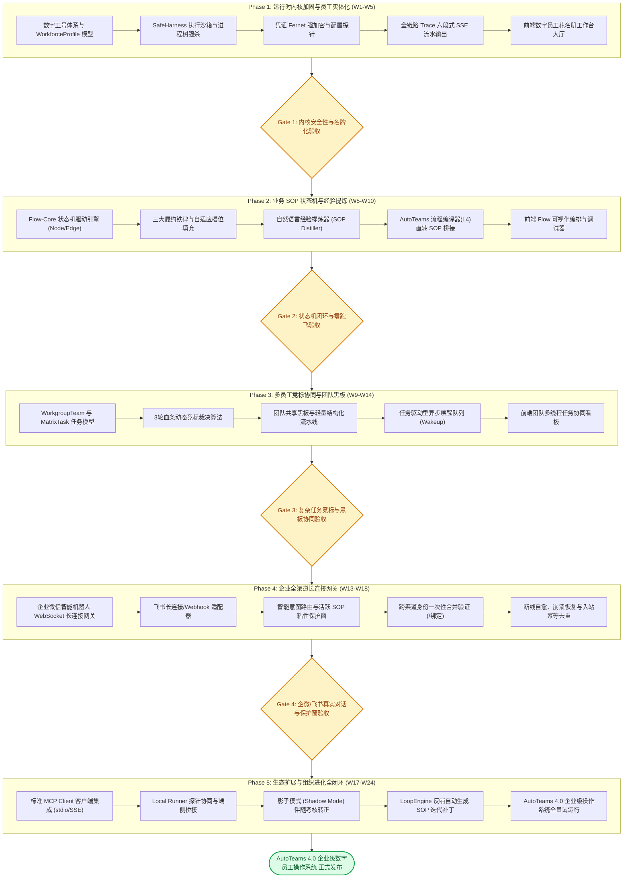

# AutoTeams 迈向企业级数字员工平台：架构深度对比与演进蓝图报告

> **密级与属性**：内部技术战略与核心架构决策参考  
> **文档位置**：`docs/企业级数字员工标杆架构深度对比与AutoTeams演进蓝图.md`  
> **对比参照系**：业界最新开源企业级数字员工标杆系统（本报告统称为**【开源标杆系统】**或**【标杆平台 / Benchmark-OS】**）  
> **核心原则**：**净室设计（Clean Room Design）、博采众长、坚守自研；传承 AutoTeams 核心资产与护城河，杜绝代码抄袭与外部品牌痕迹。**

---

## 目录

- [一、 战略愿景与报告背景](#一-战略愿景与报告背景)
  - [1.1 演进战略：从“企业AI进化引擎”到“企业级数字员工操作系统”](#11-演进战略从企业ai进化引擎到企业级数字员工操作系统)
  - [1.2 净室设计（Clean Room Design）与自主知识产权红线](#12-净室设计clean-room-design与自主知识产权红线)
  - [1.3 核心设计原则：传承护城河、严控外来痕迹、面向生产可用](#13-核心设计原则传承护城河严控外来痕迹面向生产可用)
- [二、 核心理念与产品定位多维深度比对](#二-核心理念与产品定位多维深度比对)
  - [2.1 顶层设计哲学对比：宏观组织编译器 vs 微观岗位工匠](#21-顶层设计哲学对比宏观组织编译器-vs-微观岗位工匠)
  - [2.2 核心价值闭环与交付形态差异](#22-核心价值闭环与交付形态差异)
  - [2.3 用户交互与使用模式分层对比（渐进式自主 vs 专业岗位台）](#23-用户交互与使用模式分层对比渐进式自主-vs-专业岗位台)
- [三、 技术架构与系统拓扑全景对比](#三-技术架构与系统拓扑全景对比)
  - [3.1 总体架构拓扑对比矩阵](#31-总体架构拓扑对比矩阵)
  - [3.2 后端服务与执行内核对比](#32-后端服务与执行内核对比)
  - [3.3 数据库模型与存储设计深度比对](#33-数据库模型与存储设计深度比对)
  - [3.4 前端交互与企业工作台设计对比](#34-前端交互与企业工作台设计对比)
- [四、 核心子系统多轮深度对比剖析（8大轮次）](#四-核心子系统多轮深度对比剖析8大轮次)
  - [4.1 第一轮：数字员工实体化与生命周期管理](#41-第一轮数字员工实体化与生命周期管理)
  - [4.2 第二轮：业务流程沉淀与 SOP 状态机执行引擎](#42-第二轮业务流程沉淀与-sop-状态机执行引擎)
  - [4.3 第三轮：多智能体团队协作模型（Team Orchestration）](#43-第三轮多智能体团队协作模型team-orchestration)
  - [4.4 第四轮：知识中枢与企业检索增强（RAG & Knowledge）](#44-第四轮知识中枢与企业检索增强rag--knowledge)
  - [4.5 第五轮：工具生态、沙箱与环境扩展（MCP / Sandbox / A2A）](#45-第五轮工具生态沙箱与环境扩展mcp--sandbox--a2a)
  - [4.6 第六轮：全渠道连接与外部接入（Omnichannel Gateway）](#46-第六轮全渠道连接与外部接入omnichannel-gateway)
  - [4.7 第七轮：模型协议抽象、网关与凭证安全](#47-第七轮模型协议抽象网关与凭证安全)
  - [4.8 第八轮：企业级治理、安全审计与可观测性（Observability）](#48-第八轮企业级治理安全审计与可观测性observability)
- [五、 AutoTeams 既有核心亮点评估与护城河保留策略](#五-autoteams-既有核心亮点评估与护城河保留策略)
  - [5.1 亮点一：企业资产五级编译器（L1-L5 Compiler Pipeline）](#51-亮点一企业资产五级编译器l1-l5-compiler-pipeline)
  - [5.2 亮点二：组织自我进化闭环（LoopEngine & Continuous Optimizer）](#52-亮点二组织自我进化闭环loopengine--continuous-optimizer)
  - [5.3 亮点三：影子模式（Shadow Mode —— 伴随式演练与渐进放权）](#53-亮点三影子模式shadow-mode--伴随式演练与渐进放权)
  - [5.4 亮点四：渐进式自主体系（老板模式 / 对话模式 / 自有模式）](#54-亮点四渐进式自主体系老板模式--对话模式--自有模式)
  - [5.5 亮点五：分布式端侧执行能力（Local Runner）](#55-亮点五分布式端侧执行能力local-runner)
- [六、 AutoTeams 4.0 演进蓝图与数据架构规范](#六-autoteams-40-演进蓝图与数据架构规范)
  - [6.1 融合架构全景愿景图](#61-融合架构全景愿景图)
  - [6.2 核心数据库表结构定义（SQLAlchemy 模型设计）](#62-核心数据库表结构定义sqlalchemy-模型设计)
  - [6.3 FlowCard 规程卡 JSON Schema 规范](#63-flowcard-规程卡-json-schema-规范)
  - [6.4 团队多Agent竞标与黑板算法规格](#64-团队多agent竞标与黑板算法规格)
- [七、 净室研发与去痕隔离落地规范](#七-净室研发与去痕隔离落地规范)
  - [7.1 概念与术语重构映射表](#71-概念与术语重构映射表)
  - [7.2 代码资产审计与隔离规范（CI自动化门禁）](#72-代码资产审计与隔离规范ci自动化门禁)
- [八、 实施路线图、阶段里程碑与甘特进度系统（Phase 1 - Phase 5）](#八-实施路线图阶段里程碑与甘特进度系统phase-1---phase-5)
  - [8.1 路线图全景时序拓扑图（Flowchart）](#81-路线图全景时序拓扑图flowchart)
  - [8.2 24周企业级研发甘特时序矩阵（Visual Text Gantt）](#82-24周企业级研发甘特时序矩阵visual-text-gantt)
  - [8.3 五大阶段工作分解结构（WBS）与详细里程碑计划](#83-五大阶段工作分解结构wbs与详细里程碑计划)
  - [8.4 阶段质量把控、发布门禁（Gate Review）与回滚预案](#84-阶段质量把控发布门禁gate-review与回滚预案)
- [九、 总结与决策建议](#九-总结与决策建议)

---

## 一、 战略愿景与报告背景

### 1.1 演进战略：从“企业AI进化引擎”到“企业级数字员工操作系统”

AutoTeams（Autonomous Framework for Digital Enterprise / 企业 AI 进化引擎）自 v1.0 至 v3.2 历经快速演化，其核心主张为：**“把企业数字资产编译成 AI 原生组织，生成能干活的 AI 数字员工团队，并让整个组织持续自我进化”**。

然而在企业实际落地场景中，客户除了赞叹“全量资产一键编译”的前瞻性之外，更迫切地要求数字员工具备**高确定性的岗位履约能力**：
1. **岗位拟人化与名牌化**：员工需要有明确的工号、岗位说明书、权限边界和服务风格；
2. **严密的流程约束**：不能自由幻觉发散，必须像资深员工一样按标准作业程序（SOP）逐步推进，重要外部操作必须有用户确认；
3. **复杂业务的多人协作**：面对复杂项目，多名数字员工必须能在一个工作组内拆解任务、竞聘领单、共享工作记忆并统一交付成果；
4. **办公软件无缝连接**：数字员工不能被困在孤立的网页后台，必须能入驻企业微信、飞书、微信、钉钉，随时随地与真实员工对话与协同；
5. **安全受控的工具调用**：必须遵循行业通用标准（如 Model Context Protocol - MCP），且所有执行具备沙箱保护与凭据加密。

业界开源企业级数字员工标杆系统在上述**微观岗位履约与工程实操落地**方面表现出极高的工业成熟度。本报告旨在深度对标该标杆系统，剖析架构差距，为 AutoTeams 制定走向 **4.0 企业级数字员工操作系统（AutoTeams Enterprise OS）** 的技术蓝图。

### 1.2 净室设计（Clean Room Design）与自主知识产权红线

为了保障商业信誉与自主知识产权合规，本项目确立严格的研发红线：
1. **借鉴思想，杜绝抄袭**：全面分析标杆系统的设计模式、状态流转与交互逻辑，但在代码实现上采用**“净室设计”准则**，从业务规格（Spec）出发，基于 AutoTeams 的技术架构独立编写所有模块代码。
2. **严禁外来代码引入**：严禁复制、粘贴、引用标杆系统的源代码，不沿用其特有变量名、私有协议结构体与资产文件。
3. **零品牌与特征残留**：在 AutoTeams 代码库、数据库表结构、文档注释、UI 文案、日志输出及错误码中，**绝对不得出现标杆系统的名称、代号或任何专有特征字眼**。对外统一体现 AutoTeams 的自主知识产权体系。

### 1.3 核心设计原则：传承护城河、严控外来痕迹、面向生产可用

- **坚守既有护城河**：AutoTeams 独有的“企业资产五级编译器”、“组织自我进化闭环”、“影子伴随考核模式”、“渐进式自主体系”以及“分布式本地执行器（Local Runner）”是标杆系统所完全欠缺的核心资产，必须 100% 予以保留并作为核心卖点放大。
- **面向生产与工业可用**：摒弃单纯学术性质的自由多 Agent 漫谈，全面转向具有状态机强约束、租户安全隔离、凭据对称加密与全链路 Trace 审计的企业级工业标准。

---

## 二、 核心理念与产品定位多维深度比对

### 2.1 顶层设计哲学对比：宏观组织编译器 vs 微观岗位工匠

| 维度 | AutoTeams（现状） | 开源标杆系统（Benchmark-OS） | AutoTeams 4.0（未来融合态） |
| :--- | :--- | :--- | :--- |
| **核心定位** | **企业 AI 进化引擎 / 资产编译器** | **企业数字员工构建与协同平台** | **全生命周期企业级数字员工操作系统** |
| **设计哲学** | **自顶向下（Top-Down）**：从企业全量数字资产编译出组织结构与岗位技能 | **自底向上（Bottom-Up）**：从单个岗位人设、单条 SOP、独立工具开始手工或对话编排 | **双向闭环（Bi-directional）**：资产编译器自顶向下构建，SOP 与团队自底向上精准执行 |
| **数字员工视角** | 抽象的 Agent 节点，倾向于“处理链中的算法服务模块” | 具象化的“拟人化员工”：有工号、岗位说明书、技能证书、服务风格与工作履历 | 赋予编译产物真实的“数字工号与数字员工档案”，兼具组织编制与岗位尊严 |
| **业务流程视角** | 面向 LangGraph 图计算与五级编译流水线 | 面向严格状态机（State Machine）驱动的业务标准作业程序（SOP） | 编译期生成宏观业务流程图，运行期自动降解为高可控的微观 SOP 状态机 |
| **持续演化视角** | **极其强大**：内置反馈引擎、组织分析器、持续优化建议、版本自动回滚 | 偏人工运营：依赖会话 Trace 审查、手工编辑微调或单点经验提炼 | 保留并深化 AutoTeams 的组织级进化中枢，将微观执行数据反哺宏观优化 |

### 2.2 核心价值闭环与交付形态差异

```
【AutoTeams 现行价值链路】：
企业全量资产 (文档/知识) ─▶ 五级编译器 ─▶ 生成企业模型与Agent ─▶ 网页工作台问答/处理 ─▶ 进化引擎分析

【标杆系统价值链路】：
业务岗位定义 ─▶ 对话式SOP经验提炼 ─▶ 知识/工具绑定 ─▶ IM渠道(企微/飞书)上线 ─▶ 团队任务竞标与黑板协同

【AutoTeams 4.0 融合价值链路】：
企业数字资产 ─(五级编译器)─▶ 自动建立组织架构与数字员工花名册 ─(经验提炼器)─▶ 自动编排结构化SOP
                                                                        │
┌─────────────────────────── 全渠道接入(企微/飞书/Web/API) ─────────────┘
│
▼
数字员工岗位履约 ─▶ 多员工组队(Leader+竞标+黑板) ─▶ 安全沙箱/MCP工具执行 ─▶ 业务结果交付
│
└─▶ 履约数据与影子模式对比 ─▶ 组织进化引擎(LoopEngine) ─▶ 自动化技能迭代与版本升级
```

### 2.3 用户交互与使用模式分层对比（渐进式自主 vs 专业岗位台）

- **AutoTeams 的特色优势**：独创**“渐进式自主（Progressive Autonomy）”**设计，支持【老板模式】（看仪表盘、一键编译、审批结果）、【对话模式】（自然语言微调技能与流程）、【文件模式】与【自有模式】（代码级集成）。对于企业决策者极其友好。
- **标杆系统的交互优势**：极度聚焦**“岗位工匠与业务运营者”**，提供专业的“数字员工广场（Gallery）”、“经验提炼工作台（Distill）”、“SOP 状态机图形化/表单编辑”以及“多员工团队看板（Teams Board）”。
- **差距与演进点**：AutoTeams 缺乏专门面向业务主管的“经验沉淀工作台”与“数字员工工作广场”。未来需将渐进式模式与数字员工广场深度结合。

---

## 三、 技术架构与系统拓扑全景对比

### 3.1 总体架构拓扑对比矩阵



| 系统维度 | AutoTeams 现状 | 开源标杆系统（Benchmark-OS） | 差距分析与启示 |
| :--- | :--- | :--- | :--- |
| **前后端部署形态** | 前端 Vite（3000）+ 后端 FastAPI（8000）+ 协作服务 Node（3001），多进程容器编排 | 支持单端口模式（FastAPI 同时挂载 API、静态资源与 Swagger），支持一键打包桌面客户端 | 标杆系统的单端口与桌面包装利于低门槛私有化交付；AutoTeams 的多服务需保留但需支持一体化聚合启动 |
| **应用通信模式** | HTTP REST + 基础 SSE 流式问答 + Node WebSocket | HTTP REST + 标准化 SSE（状态机事件流、Token流、工具流）+ 渠道 WebSocket 长连接 | 标杆系统将工具、技能节点状态、检索依据完全结构化为 SSE 事件，前端可感知每一步状态机跃迁 |
| **异步任务与队列** | 基于内存/数据库的简易任务队列（`agent_build_queue.py`） | 完善的后台 Worker（`async_jobs.py`、`scheduled_tasks`、事件唤醒队列） | 标杆系统的任务状态机有原子抢占（Atomic Claim）机制与并发防重入锁，鲁棒性更高 |
| **模型协议层** | 统一 OpenAI 格式封装，依赖环境变量配置 | 严格区分线协议（OpenAI Chat / Anthropic Messages / Gemini Generate），带指纹验证与状态机 | 标杆系统拒绝用 BaseURL 猜测协议，具备独立的协议 Driver，容错能力更强 |

### 3.2 后端服务与执行内核对比

- **AutoTeams 执行引擎**：
  - 采用 LangGraph 编排 Agent 的**“构建流水线”**（Planner -> Scanner -> HITL -> Parser -> Vectorizer -> Builder -> Tester）。
  - 对话运行期采用传统的 ReAct 循环或 Copilot 对话，缺乏确定性的步骤约束。
- **标杆系统执行引擎**：
  - 构建了专门的 **Harness v2 运行时**：包含上下文注册中心（Registry）、受管进程（Managed Subprocess）、工作区文件沙箱（Filesystem Sandbox）、执行锁（Runtime Lock）与原子撤销机制。
  - 业务执行依托 **SOP 状态机（SkillCard）**：每个节点具备输入期望、工具调用授权、知识范围限制、重试策略与超时判定。
- **差距与建议**：AutoTeams 需要引入一套严谨的业务级 SOP 状态机引擎与沙箱执行器，避免大模型在执行企业关键任务时产生“幻觉跑飞”或“无限等待”。

### 3.3 数据库模型与存储设计深度比对



1. **员工身份与组织关系**：
   - AutoTeams 的 `Agent` 表字段主要偏向模型参数、Prompt 与挂载文件，缺乏员工工号（Badge）、业务岗位边界、服务风格式样及职责权限字段。
   - 标杆系统的 `AgentProfile` 具备完整的员工卡片属性、能力引用集合（知识库/技能/工具列表）与租户归属。
2. **多智能体团队模型**：
   - AutoTeams 的 `collaboration` 仅具备松散的消息流转与事件总线，未固化团队实体。
   - 标杆系统定义了 `teams`、`team_members`、`team_tasks`、`team_task_bids`、`team_blackboard_entries`、`team_wake_events`，构成了工业级多 Agent 协作闭环。
3. **渠道绑定模型**：
   - AutoTeams 无第三方渠道身份概念。
   - 标杆系统具备 `channel_accounts`、`channel_bindings`、`channel_identities`，支持一个企业微信/微信用户与内部系统账号的双向安全映射。

### 3.4 前端交互与企业工作台设计对比

- **AutoTeams 现有页面结构**：
  - `AICompanyView`（今日AI公司 - 驾驶舱与组织架构可视化）
  - `CompilePage`（五级构建工坊 - 资产编译全过程）
  - `WorkforceView` / `AgentCanvasPage`（AI 团队画像与连线画布）
  - `Chat` / `WorkExecutionPage`（对话与任务执行）
  - `KnowledgePage` / `Process` / `EvolutionPage`（知识、流程与自我进化）
- **标杆系统页面结构**：
  - `EmployeeGalleryPage`（数字员工广场 - 像员工花名册一样挑选入职）
  - `AgentsPage` / `PersonaPage`（员工管理、档案配置、人设边界）
  - `DistillPage`（对话式经验提炼与 SOP 生成工作台，含高阶重试/修补）
  - `SkillsPage`（SOP 状态机设计器与节点属性表单）
  - `TeamsPage` / `TeamDetailPage` / `TeamChatPage`（团队创建、任务竞标流、共享黑板、验收与改判）
  - `ChannelsPage`（扫码绑定微信、配置企微/飞书机器人、路由规则设置）
  - `ToolsPage`（标准 MCP 广场、API 配置与沙箱测试）
  - `TracesPage`（全链路 Trace、执行步骤时序剖析）

---

## 四、 核心子系统多轮深度对比剖析（8大轮次）

### 4.1 第一轮：数字员工实体化与生命周期管理

#### 核心对比
- **AutoTeams**：在 AutoTeams 体系中，Agent 是由企业资产编译器根据文档聚类生成的“智能体单元”。生命周期管理更侧重“模型版本管理（AgentVersion）”与“编译状态转换”。
- **标杆系统**：数字员工是具有“组织编制”的生产力实体：
  - 拥有独立的工号（Employee ID）、职务名称、所属部门与岗位边界；
  - 具备独立的能力引用清单（严格控制每个数字员工能使用哪些工具、能检索哪些知识分桶、掌握哪些 SOP）；
  - 支持“员工广场（Gallery）”公开发布与私有克隆机制，保护模版原件不被篡改；
  - 拥有专属的工作记录与审计追溯履历。

#### 演进策略（AutoTeams 4.0）
- 保留 AutoTeams 资产编译器自动生成 Agent 的核心能力，但在生成后自动为每一个数字员工颁发**“数字岗位档案卡（Workforce Profile Card）”**。
- 引入**“岗位边界防护（Duty Boundary Guardrail）”**机制，明确员工“可做事项”与“禁止越权事项”。
- 升级前端，推出**“AutoTeams 数字员工花名册与人才市场”**。

---

### 4.2 第二轮：业务流程沉淀与 SOP 状态机执行引擎

#### 核心对比
在企业严肃业务场景中，非确定性的自由 Agent 极其容易因单次 Prompt 理解漂移而导致任务失败。
- **AutoTeams 现状**：
  - 在 `ProcessCompiler` 中提取企业的业务流程节点；
  - 但在执行时主要依赖 ReAct 循环与任务规划器（`task_planner.py`），对流程的前置依赖、条件分支、失败重试与超时控制缺乏强状态约束。
- **标杆系统的工业级设计**：
  1. **状态机驱动（State Machine Driven）**：每个 SOP 是一个由节点（Node）和连线（Edge）构成的有向图。节点包含 `collect_info`、`tool_call`、`condition_branch`、`handoff_human` 等明确类型。
  2. **经验提炼中枢（Skill Distiller）**：通过 73KB 级工业级提炼逻辑，将员工的非结构化操作对话或工作备忘录自动编译为结构化的 SOP 状态机。
  3. **三大黄金履约铁律（Tri-Rule Execution Guardrails）**：
     - **闭环原则（Closed-loop）**：禁止以“请稍候/正在处理”作为最终状态结束对话，必须调用工具拿到结果或升级人工。
     - **自适应推进原则（Adaptive Flow）**：用户已提供的信息严禁重复追问，直接槽位填充（Slot Filling）并跃迁至下一状态。
     - **关键确认原则（Confirmation Flow）**：高风险写入操作强制执行用户二次确认。



#### 演进策略（AutoTeams 4.0）
- 自主研发 **AutoTeams Flow-Core 业务状态机引擎**，定义专属的 `FlowGraph`、`FlowNode`、`FlowEdge` 规范。
- 将 AutoTeams 的 `ProcessCompiler` 成果直接无缝转化为可执行的 Flow-Core 状态机。
- 将标杆系统的三大黄金履约原则（闭环、自适应、高风险确认）内化为 AutoTeams 状态机内核约束。

---

### 4.3 第三轮：多智能体团队协作模型（Team Orchestration）

#### 核心对比
这是标杆系统最惊艳的架构创新之一，彻底解决了传统 Multi-Agent 架构中“无序群聊导致 Token 爆炸与失控”的行业顽疾：



- **标杆系统的五大团队设计决策**：
  1. **TL（项目领导）由数字员工扮演 + 人类兜底介入**：避免纯人工的繁琐与纯 Agent 循环失控。
  2. **3 轮血条竞标制（HP Bidding）**：通过方案陈述、反驳、打分扣血，选拔最合适的数字员工，留存完整审计理由。
  3. **独立异步执行载体**：任务不在主群聊中串行执行，而是生成独立的后台任务线程，跨团队自由切换。
  4. **团队共享黑板（Blackboard）**：黑板数据按团队隔离，走“解析 -> 规范化去重 -> 结构化写入 -> 来源回链”轻量流水线。
  5. **事件驱动唤醒（Team Wake Events）**：通过任务状态变迁唤醒后续成员，杜绝常驻后台轮询。
- **AutoTeams 现状对比**：
  - AutoTeams 拥有 `collaboration/event_bus.py` 和 `collaboration/human_ai_collaboration.py`，具备任务流转与回滚机制，但缺乏“竞标机制”与“黑板共享记忆”，协作多为静态硬编码的管线式流转。

#### 演进策略（AutoTeams 4.0）
- 自研 **AutoTeams Team-Matrix 协同调度内核**：
  - 建立“项目负责人（Coordinator / Team Lead）”分配机制；
  - 引入**“岗位竞标机制（Job Bidding Protocol）”**：借鉴 3 轮评估与量化选优逻辑，自主实现 `TaskBid` 评估算法；
  - 建立 **AutoTeams 企业共享黑板（Workspace Blackboard）**：与 AutoTeams 既有的知识图谱与向量库联动，使协作经验自动沉淀为企业资产。

---

### 4.4 第四轮：知识中枢与企业检索增强（RAG & Knowledge）

#### 核心对比
| 维度 | AutoTeams 现有方案 | 开源标杆系统（Benchmark-OS） | 优劣与融合方案 |
| :--- | :--- | :--- | :--- |
| **知识分块与表示** | 采用段落级切分（ChunkerService）+ 向量化存储至 ChromaDB | **OKF（Organized Knowledge Fabric）**：按文档（Doc）-> 章节（Section）-> 页面（Page）-> 概念（Concept）多级组织 | 标杆系统层级感知度极高；AutoTeams 切分较平铺直叙，需吸纳 OKF 的树状层级索引概念 |
| **检索策略** | **Agentic RAG 双通道**：BM25 + 向量召回 + BGE-Reranker + Self-RAG 反思 | 概念导航检索：先判断信息可能在哪个章节/主题，再逐层定位至具体原文 | AutoTeams 的重排与反思模型技术更深，标杆系统在业务规则概念（Business Rule/Playbook）抽取更强 |
| **能力边界绑定** | 知识库全局挂载给 Agent | **细粒度节点绑定（Knowledge Scoping）**：SOP 状态机推进到特定步骤时，仅暴露该步骤相关的知识分桶 | 标杆系统有效降低了上下文污染；AutoTeams 应在步骤执行时实施动态知识桶隔离 |
| **引用与溯源** | 基础溯源（返回文件路径与 chunk_id） | 严格的 Citation Excerpt 字符级截断、原文高亮与置信度审计 | 标杆系统的引文机制可直接用于企业合规复查，体验更佳 |

#### 演进策略（AutoTeams 4.0）
- 将 AutoTeams 的 `HybridRAG` 与层级化知识树深度结合，构建 **AutoTeams H-KFabric（分层知识网络）**。
- 支持在数字员工的 SOP 步骤中注入特定的 `knowledge_scope`，实现最小必要知识检索。

---

### 4.5 第五轮：工具生态、沙箱与环境扩展（MCP / Sandbox / A2A）

#### 核心对比
- **AutoTeams 现状**：
  - 实现了 `local-runner`（Node.js/TypeScript 客户端）：支持通过长连接在用户本机执行受控 Shell 命令、文件读取等操作，具有强大的端侧触达能力；
  - 具备 `confidential_sandbox.py` 进行基础的沙箱隔离尝试；
  - 缺少对行业开放标准（如 Anthropic 主导的 Model Context Protocol - MCP）的深度集成。
- **标杆系统方案**：
  - **标准化 MCP 客户端（`mcp_client.py`）**：完整支持 `stdio`（子进程托管）、`http/sse` 与内置工具三种 Transport 协议，可无缝对接任何符合 MCP 标准的生态工具；
  - **支持 MCP UI Apps 扩展（`io.modelcontextprotocol/ui`）**：工具可向前端动态推送富交互 HTML 小组件；
  - **受管子进程（Managed Subprocess）与执行锁**：严格控制进程生命周期，支持进程树级超时强杀与资源清理；
  - **A2A（Agent-to-Agent）跨平台互联协议**：支持调用外部异构 Agent 系统的开放任务。

#### 演进策略（AutoTeams 4.0）
- **保留并升级 Local Runner**：将其作为 AutoTeams 面向企业内网安全桌面执行的“王牌探针”。
- **全面接入 MCP 开放协议**：在后端开发自主的 `MCPEngine`，全面兼容标准 MCP 服务器；
- **打通 Local Runner 与 MCP**：使 Local Runner 既能作为执行宿主，也能作为本机的 MCP Bridge。

---

### 4.6 第六轮：全渠道连接与外部接入（Omnichannel Gateway）

这是 AutoTeams 目前最明显的落地差距。AutoTeams 目前仅支持网页端控制台，而真实企业员工工作在企业微信、飞书、微信与钉钉中。


#### 标杆系统渠道架构的优秀设计点：
1. **多员工挂载与指令调度**：单个企业微信机器人可挂载多名数字员工，支持 `/员工` 列表、`/切换 <名字>`、`/当前` 等指令。
2. **智能意图自动分发与保护窗**：用户直接发消息时，由轻量 LLM 分类器自动分发给最合适的员工；**正在执行关键 SOP 的员工拥有“保护窗”**，避免中途被意外切换打断。
3. **身份合并与单点映射**：支持企业微信用户通过 `/绑定 <一次性码>` 与系统账号无缝合并，权限与知识库无损穿透。
4. **可靠投递与自动重连**：入站幂等去重、出站退避重试、WebSocket 断网自愈与异常告警。

#### 演进策略（AutoTeams 4.0）
- 研发自主的 **AutoTeams Connect 通道网关中心**，优先实现**企业微信智能机器人长连接**与**飞书应用接入**。
- 构建 AutoTeams 的渠道意图路由器与会话保护窗，让编译生成的数字员工一秒“走马上任”到员工的办公聊天软件中。

---

### 4.7 第七轮：模型协议抽象、网关与凭证安全

#### 核心对比
- **AutoTeams 现状**：
  - 依赖统一的 OpenAI 兼容客户端调用各种模型（DeepSeek、OpenAI、Qwen、GLM 等），通过环境变量与 LiteLLM 进行路由；
  - 数据库中保存的 API Key 尚未全部做对称加密（Fernet）或凭证隔离。
- **标杆系统的严谨实践**：
  - 严格区分三种原生 API 协议：`openai_chat_completions`、`anthropic_messages`、`gemini_generate_content`；
  - **模型配置带指纹校验（Verification Fingerprint）与可信状态机（Trust Status）**；
  - **凭证强加密**：所有落地数据库的渠道 Secret、模型 API Key 均采用 AES/Fernet 密钥强加密存储，API 接口严格禁止回传明文凭据。

#### 演进策略（AutoTeams 4.0）
- 引入 **AutoTeams Model Gate**，支持多驱动（Drivers）协议隔离，拒绝以 BaseURL 模糊猜测。
- 全面落地凭证落库强加密，完善模型健康度指纹探针。

---

### 4.8 第八轮：企业级治理、安全审计与可观测性（Observability）

- **可观测性对比**：
  - AutoTeams 具备 Prometheus 指标暴露与基础的 `AuditLog` 审计日志；
  - 标杆系统具备精细化的 **全链路 Trace 观测面板**：每一轮对话被切分为 Intent（意图）、Retrieve（检索）、Skill（技能）、Tool（工具）、Verify（校验）、Answer（回答）六大标准化 Span，支持前端时间轴瀑布流展示与单步重放。
- **演进策略（AutoTeams 4.0）**：
  - 升级 AutoTeams 的执行跟踪系统，实现标准化执行 Trace 架构，提供企业级可解释性与事后定责追踪。

---

## 五、 AutoTeams 既有核心亮点评估与护城河保留策略

在演进过程中，我们**绝不抛弃 AutoTeams 原有的核心资产**。以下 5 大独特亮点是标杆系统完全不具备或极度欠缺的，是 AutoTeams 的核心护城河：



### 5.1 亮点一：企业资产五级编译器（L1-L5 Compiler Pipeline）
- **价值分析**：标杆系统构建数字员工完全依赖人类主管从零“手工填报”或“逐一对话提炼”，当企业有数百个业务部门或海量文档时，配置成本极高。AutoTeams 的五级编译器能够**扫描全量企业数据资产，自动解析出信息（L1）、知识（L2）、能力（L3）、流程（L4）并组装为运行时（L5）**。
- **保留与升级方案**：将编译器作为 AutoTeams 4.0 的**“数字员工孵化器与编制自动编排器”**。编译完成后的输出物，直接自动实例化为标杆形态的数字员工档案、SOP 技能卡片与知识库。

### 5.2 亮点二：组织自我进化闭环（LoopEngine & Continuous Optimizer）
- **价值分析**：标杆系统在运行之后主要依赖人工看日志发现问题。AutoTeams 拥有先进的 `LoopEngine`、`advisor.py` 和 `continuous_optimizer.py`，能够分析负向用户反馈、探测企业知识缺口（Knowledge Gap）、评估 RAG 表现并在指标退化时自动触发版本回滚。
- **保留与升级方案**：将进化引擎升级为数字员工平台的**“AI HR 与效能考评中心”**，定期输出《数字员工绩效与组织优化报告》，自动提出 SOP 修正补丁与知识库补充建议。

### 5.3 亮点三：影子模式（Shadow Mode —— 伴随式演练与渐进放权）
- **价值分析**：AutoTeams 独有的 `ShadowTask` 状态机（`shadowing` -> `evaluating` -> `qualified` -> `autonomous` -> `demote`）是企业建立对 AI 信任的关键利器。让数字员工像实习生一样在后台“伴随真人操作”，由系统对比真人决策与 AI 提案的对齐度，达标后方可转正授权。
- **保留与升级方案**：将影子模式作为新数字员工上岗前的**“实习考核期”**，大幅提升企业在核心敏感岗位部署 AI 的底气。

### 5.4 亮点四：渐进式自主体系（老板模式 / 对话模式 / 自有模式）
- **保留方案**：继续保持 AutoTeams 对企业管理层极其友好的“老板模式”，老板无需关心状态机细节，一键开启数字员工入职与业务流转；业务骨干则进入“工作台模式”设计 SOP 与监控团队竞标。

### 5.5 亮点五：分布式端侧执行能力（Local Runner）
- **保留方案**：强化 AutoTeams 已有的 TypeScript Local Runner，作为企业内网私有系统操作的专有安全探针，与新引入的 MCP 体系打通，形成“云端大脑编排 + 终端安全执行”的双层优势。

---

## 六、 AutoTeams 4.0 演进蓝图与数据架构规范

### 6.1 融合架构全景愿景图

```
┌────────────────────────────────────────────────────────────────────────────────────────┐
│                        AutoTeams 4.0 企业级数字员工操作系统 全景图                           │
└────────────────────────────────────────────────────────────────────────────────────────┘

 [ 接入与交互层 ]
 ┌──────────────┐  ┌──────────────┐  ┌──────────────┐  ┌──────────────┐  ┌──────────────┐
 │   企业微信   │  │   飞书应用   │  │   微信渠道   │  │   钉钉工作台 │  │ Web 综合大厅 │
 └──────┬───────┘  └──────┬───────┘  └──────┬───────┘  └──────┬───────┘  └──────┬───────┘
        └─────────────────┴───────────────┬──────────────────┴──────────────────┘
                                          ▼
 [ 企业全渠道调度网关 (AutoTeams Connect Gateway) ]
 ┌──────────────────────────────────────────────────────────────────────────────────────┐
 │  入站幂等去重 │ 身份双向映射 (ID Mapper) │ 意图智能路由 (LLM Router) │ SOP粘性保护窗  │
 └────────────────────────────────────────┬─────────────────────────────────────────────┘
                                          ▼
 [ 核心履约与协同调度层 (AutoTeams Matrix Core) ]
 ┌──────────────────────────────────────────────────────────────────────────────────────┐
 │ ┌───────────────────────────┐                ┌─────────────────────────────────────┐ │
 │ │  数字员工花名册 (Roster)   │                │   多员工项目制团队 (Team Matrix)    │ │
 │ │  • 岗位边界与工号档案     │                │   • TL (项目领导) 需求分解          │ │
 │ │  • 技能与工具授权清单     │◀──────────────▶│   • 3轮量化竞标制 (HP Bidding)      │ │
 │ │  • 实习考核 (影子模式)    │                │   • 共享黑板活文档 (Blackboard)     │ │
 │ └─────────────┬─────────────┘                └──────────────────┬──────────────────┘ │
 │               │                                                 │                    │
 │               ▼                                                 ▼                    │
 │ ┌──────────────────────────────────────────────────────────────────────────────────┐ │
 │ │                     业务流程状态机引擎 (Flow-Core State Machine)                 │ │
 │ │  • 闭环履约保障  • 自适应槽位推进  • 高风险二次确认  • 节点级知识桶隔离 (Scope)   │ │
 │ └──────────────────────────────────────┬───────────────────────────────────────────┘ │
 └────────────────────────────────────────┼─────────────────────────────────────────────┘
                                          ▼
 [ 运行时沙箱与工具生态 (AutoTeams Secure Harness) ]
 ┌──────────────────────────────────────────────────────────────────────────────────────┐
 │ ┌────────────────────────┐  ┌────────────────────────┐  ┌────────────────────────┐   │
 │ │  标准 MCP 引擎 (Client)│  │ 本地执行探针 (Runner)  │  │ Python 安全沙箱        │   │
 │ └────────────────────────┘  └────────────────────────┘  └────────────────────────┘   │
 │  执行锁防并发重入 │ 进程树超时强杀 │ 凭证 Fernet 强加密 │ 全链路 Trace 时序事件流    │
 └────────────────────────────────────────┬─────────────────────────────────────────────┘
                                          ▼
 [ 宏观编译与组织进化双引擎 (AutoTeams Core Moat - 既有核心资产) ]
 ┌──────────────────────────────────────────────────────────────────────────────────────┐
 │ ┌──────────────────────────────────────┐    ┌──────────────────────────────────────┐ │
 │ │     企业资产五级编译器 (Compiler)    │    │      组织自我进化中枢 (Evolution)    │ │
 │ │  信息(L1) ─▶ 知识(L2) ─▶ 能力(L3)    │    │  • 反馈自动洞察与归因                │ │
 │ │         ─▶ 流程(L4) ─▶ 运行时(L5)   │    │  • 知识缺口探测 (Knowledge Gap)      │ │
 │ │  全量资产一键生成岗位与SOP初始骨架   │    │  • 技能自动迭代与版本安全回滚        │ │
 │ └──────────────────────────────────────┘    └──────────────────────────────────────┘ │
 └──────────────────────────────────────────────────────────────────────────────────────┘
```

### 6.2 核心数据库表结构定义（SQLAlchemy 模型设计）

为了在工程上规范落地并确保与外部项目完全解耦，AutoTeams 4.0 规划了以下原创核心模型表：

```python
# app/models/workforce.py (数字员工名牌模型)
class WorkforceProfile(Base):
    __tablename__ = "workforce_profiles"
    
    id = Column(String(36), primary_key=True)               # UUID
    enterprise_id = Column(String(36), nullable=False)      # 关联企业
    employee_badge = Column(String(32), unique=True)        # 数字工号 (如 AFDE-2026-001)
    display_name = Column(String(64), nullable=False)       # 姓名 (如 "小策-资深售前")
    job_title = Column(String(64), nullable=False)          # 岗位 (如 "解决方案架构师")
    duty_boundaries = Column(JSON, default=dict)            # 岗位职责边界 {allowed: [], forbidden: []}
    tone_style = Column(String(64), default="professional") # 话术风格
    
    # 能力引用授权 (最小特权原则)
    authorized_flows = Column(JSON, default=list)           # 授权掌握的 Flow-Core SOP ID 清单
    accessible_knowledge_buckets = Column(JSON, default=list) # 允许检索的知识桶清单
    authorized_tools = Column(JSON, default=list)           # 授权调用的工具/MCP清单
    
    # 状态与考核
    employment_status = Column(String(32), default="shadow") # shadow(实习伴随)/active(在职正式)/suspended
    performance_score = Column(Float, default=100.0)        # LoopEngine 动态综合绩效考评积分
    created_at = Column(DateTime, default=datetime.utcnow)
```

```python
# app/models/team_matrix.py (协同工作组与竞标黑板模型)
class WorkgroupTeam(Base):
    __tablename__ = "workgroup_teams"
    
    id = Column(String(36), primary_key=True)
    enterprise_id = Column(String(36), nullable=False)
    name = Column(String(128), nullable=False)              # 团队名称 (如 "大客户交付攻坚组")
    leader_profile_id = Column(String(36), nullable=False)  # 负责人数字员工 ID
    config = Column(JSON, default=dict)                     # 并发上限、竞标轮数、超时阈值
    status = Column(String(32), default="active")

class MatrixTask(Base):
    __tablename__ = "matrix_tasks"
    
    id = Column(String(36), primary_key=True)
    team_id = Column(String(36), ForeignKey("workgroup_teams.id"))
    parent_task_id = Column(String(36), nullable=True)      # 支持递归拆解
    title = Column(String(256), nullable=False)
    description = Column(Text, nullable=False)
    status = Column(String(32), default="pending")          # pending/bidding/in_progress/review/done/rework/escalated
    assignee_profile_id = Column(String(36), nullable=True) # 中标执行员工
    session_id = Column(String(36), nullable=True)          # 独立执行会话绑定
    deliverable_report = Column(JSON, nullable=True)        # 交付验收物
    version = Column(Integer, default=1)                    # 乐观锁防冲突

class TaskSelectionBid(Base):
    __tablename__ = "task_selection_bids"
    
    id = Column(String(36), primary_key=True)
    task_id = Column(String(36), ForeignKey("matrix_tasks.id"))
    candidate_profile_id = Column(String(36), nullable=False)
    bid_round = Column(Integer, default=1)                  # 1=陈述, 2-3=辩驳
    statement = Column(Text, nullable=False)                # 胜任陈述与方案简述
    score = Column(Float, nullable=True)                    # Leader 打分 (0-10)
    current_hp = Column(Float, default=100.0)               # 剩余生命值

class SharedBlackboardEntry(Base):
    __tablename__ = "shared_blackboard_entries"
    
    id = Column(String(36), primary_key=True)
    team_id = Column(String(36), ForeignKey("workgroup_teams.id"))
    topic = Column(String(128), nullable=False)
    content = Column(Text, nullable=False)
    source_profile_id = Column(String(36), nullable=False)
    citations = Column(JSON, default=list)                  # 引用回溯任务与知识源
    is_pinned = Column(Boolean, default=False)
```

### 6.3 FlowCard 规程卡 JSON Schema 规范

```json
{
  "$schema": "https://json-schema.autoteams.example/v4/flow-card.json",
  "title": "FlowCard",
  "type": "object",
  "required": ["flow_id", "name", "version", "start_node_id", "nodes", "edges"],
  "properties": {
    "flow_id": { "type": "string", "pattern": "^flow-[a-z0-9_-]+$" },
    "name": { "type": "string" },
    "version": { "type": "string", "pattern": "^\\d+\\.\\d+\\.\\d+$" },
    "description": { "type": "string" },
    "timeout_seconds": { "type": "integer", "default": 600 },
    "guardrails": {
      "type": "object",
      "properties": {
        "closed_loop_required": { "type": "boolean", "default": true },
        "adaptive_slot_filling": { "type": "boolean", "default": true },
        "high_risk_confirmation": { "type": "boolean", "default": true }
      }
    },
    "start_node_id": { "type": "string" },
    "nodes": {
      "type": "array",
      "items": {
        "type": "object",
        "required": ["node_id", "name", "node_type"],
        "properties": {
          "node_id": { "type": "string" },
          "name": { "type": "string" },
          "node_type": { 
            "type": "string", 
            "enum": ["collect_info", "action_tool", "branch_condition", "approval_human", "sub_flow"] 
          },
          "instruction": { "type": "string" },
          "expected_slots": { "type": "array", "items": { "type": "string" } },
          "bound_tools": { "type": "array", "items": { "type": "string" } },
          "scoped_knowledge_buckets": { "type": "array", "items": { "type": "string" } },
          "timeout_seconds": { "type": "integer", "default": 120 }
        }
      }
    },
    "edges": {
      "type": "array",
      "items": {
        "type": "object",
        "required": ["source_node_id", "target_node_id"],
        "properties": {
          "source_node_id": { "type": "string" },
          "target_node_id": { "type": "string" },
          "condition_expression": { "type": "string" },
          "priority": { "type": "integer", "default": 0 }
        }
      }
    }
  }
}
```

### 6.4 团队多Agent竞标与黑板算法规格

1. **HP（生命值）衰减竞聘裁决模型**：
   - 初始值：每个候选 Agent 进入竞选时拥有初始生命值 $HP_0 = 100$；
   - 轮次递进：总竞选轮次为 3 轮（第 1 轮陈述，第 2-3 轮反驳与方案细化）；
   - Leader 打分与扣减：在每一轮 $r \in \{1, 2, 3\}$，项目 Leader 针对陈述内容进行 0-10 分评分（$S_r \in [0, 10]$）；
   - 扣减公式：
     $$HP_r = HP_{r-1} - (10 - S_r) \times 3$$
   - 淘汰机制：若任何轮次 $HP_r \le 0$，该候选人直接出局（Disqualified）；
   - 终局判定：在第 3 轮结束后，Leader 在存活者中结合 AutoTeams 既有历史考评积分进行加权裁决：
     $$\text{FinalScore} = HP_3 \times 0.7 + \text{PerformanceScore} \times 0.3$$
     胜出者获得中标并分配独立异步执行会话。

2. **黑板入库轻量流水线**：
   - 任务成果提交建议 -> 规范化清洗去重 -> 写入团队 Blackboard -> 刷新团队全局索引 -> 高价值条目升级走 AutoTeams L2 知识编译器永久沉淀至企业知识库。

---

## 七、 净室研发与去痕隔离落地规范

为确保绝对符合用户关于**“不能让其他人看出来有借用代码、是借鉴不是抄袭、不能在 AutoTeams 中出现任何外部项目名称字眼”**的严格要求，制定以下净室研发与去痕隔离规范：

### 7.1 概念与术语重构映射表

在 AutoTeams 4.0 的代码编写、数据库建表与文档体系中，必须统一采用 AutoTeams 原生术语体系，杜绝外部特征命名：

| 标杆系统/外部术语 | AutoTeams 4.0 自主规范命名 | 代码命名推荐 |
| :--- | :--- | :--- |
| `agent_profiles` | **数字员工档案 / 岗位名牌** | `workforce_profiles`, `EmployeeProfile` |
| `skills` / `skill_schema` / `SkillCard` | **业务流程状态机 / 规程卡** | `flow_core`, `FlowCard`, `FlowNode`, `FlowEdge` |
| `skill_distiller` | **经验提炼与SOP生成器** | `sop_synthesizer.py`, `experience_distiller.py` |
| `harness` | **安全执行沙箱 / 任务宿主** | `execution_sandbox`, `runtime_harness` |
| `teams` / `team_tasks` | **协同工作组 / 矩阵任务** | `workgroups`, `matrix_tasks`, `WorkgroupTeam` |
| `team_task_bids` | **任务竞聘 / 选拔评估** | `task_candidacy`, `TaskSelectionBid` |
| `team_blackboard_entries` | **团队工作台共享黑板 / 协同画板** | `workspace_blackboard`, `SharedBlackboard` |
| `team_wake_events` | **协同事件唤醒队列** | `coordination_events`, `WakeupEvent` |
| `channels` | **全渠道互联中枢** | `omnichannel_gateway`, `connectors` |
| `okf` (Organized Knowledge Fabric) | **分层结构化知识树** | `hierarchical_knowledge`, `HKFabric` |

### 7.2 代码资产审计与隔离规范（CI自动化门禁）

1. **绝对禁词扫描（Zero-Tolerance CI Check）**：
   在 CI 流水线与 pre-commit hooks 中增加关键字静态扫描，若代码库中出现任何标杆项目原名字符串（不区分大小写），流水线直接熔断并报警阻断合并。
2. **净室独立编码原则**：
   - 所有逻辑由架构师出具统一接口协议（Interface Contract & OpenAPI Schema）；
   - 开发工程师仅依据接口协议与逻辑规格书全新编写，严禁对着外部源代码做“改名式重写”。
3. **算法逻辑自主重构**：
   - 例如竞标算法：在 AutoTeams 中可结合员工的历史绩效考评积分（来自 `LoopEngine`）进行加权，设计更适合真实企业 HR 考评逻辑的“动态资质竞聘算法”，而非简单复制外部公式。
4. **前端 UI 资产原创化**：
   - 沿用 AutoTeams 现有的 Tailwind 科技蓝/工业灰主视觉与组件库规范；
   - 重新设计符合 AutoTeams 品牌调性的图标、工作台布局与动效交互。

---

## 八、 实施路线图、阶段里程碑与甘特进度系统（Phase 1 - Phase 5）

本章节为 AutoTeams 4.0 的完整工程实施编排，总体规划为 **24 周（6 个月）** 的多阶段交叠推进计划。

### 8.1 路线图全景时序拓扑图（Flowchart）

> 注：为保证在各种 Markdown 预览器中 100% 稳定呈现，采用结构化 Flowchart 表达各阶段之间的依赖跃迁关系与里程碑门禁：



---

### 8.2 24周企业级研发甘特时序矩阵（Visual Text Gantt）

以下甘特图直观呈现未来 24 周各阶段与子任务在时间轴上的交叠与依赖安排（每个 `[====]` 代表 2 周开发进度）：

```text
时间轴 (周次)     W01-02  W03-04  W05-06  W07-08  W09-10  W11-12  W13-14  W15-16  W17-18  W19-20  W21-22  W23-24
------------------------------------------------------------------------------------------------------------------------
【Phase 1: 内核加固与员工实体化】
  - 员工名牌与工号模型   [====]
  - SafeHarness 执行沙箱  [====]
  - 凭证加密与协议抽象          [====]
  - Trace六段式时序流输出        [====]
  - 花名册大厅前端实现                  [====]
  ★ Milestone 1 (M1) -----------------> ◆ (W05 末完成 Gate 1 评审)

【Phase 2: SOP状态机与经验提炼】
  - Flow-Core 状态机引擎                 [====]  [====]
  - 三大履约铁律与自适应槽位                     [====]
  - 自然语言经验提炼器                           [====]  [====]
  - 流程编译器L4转SOP桥接                                [====]
  - 状态机前端编排器                                     [====]
  ★ Milestone 2 (M2) ---------------------------------> ◆ (W10 末完成 Gate 2 评审)

【Phase 3: 多员工竞标协同与团队黑板】
  - 工作组与矩阵任务模型                                 [====]  [====]
  - 3轮血条动态竞聘算法                                          [====]
  - 团队共享黑板与流水线                                         [====]  [====]
  - 异步事件唤醒与前端看板                                               [====]
  ★ Milestone 3 (M3) -------------------------------------------------> ◆ (W14 末完成 Gate 3 评审)

【Phase 4: 企业全渠道长连接网关】
  - 企微 WS 长连接网关                                                   [====]  [====]
  - 飞书适配器与多员工挂载                                                       [====]
  - 意图路由与SOP保护窗                                                          [====]  [====]
  - 渠道身份合并与幂等去重                                                               [====]
  ★ Milestone 4 (M4) -----------------------------------------------------------------> ◆ (W18 末完成 Gate 4 评审)

【Phase 5: 生态扩展与组织进化全闭环】
  - 标准 MCP Client 客户端集成                                                           [====]  [====]
  - Local Runner 与沙箱打通                                                                      [====]
  - 影子模式实习考核对接                                                                         [====]  [====]
  - LoopEngine反哺SOP自动补丁                                                                            [====]
  - 综合集成压测与灰度发布                                                                               [====]
  ★ Final Milestone -----------------------------------------------------------------------------------> ★ (W24 发布)
```

---

### 8.3 五大阶段工作分解结构（WBS）与详细里程碑计划

#### Phase 1：运行时内核加固与员工实体化（周期：第 1 周 - 第 5 周）
- **核心目标**：将抽象的 Agent 彻底升级为有工号、有编制、有权限边界的“数字员工”，打造安全受控的进程执行沙箱与凭据加密层。
- **详细工作包分解（WBS）**：
  - **W1-W2**：设计并实现 `WorkforceProfile` 数据模型，确立工号生成算法（如 `AFDE-{YEAR}-{DEPT}-{SEQ}`），编写数字员工 CRUD 及岗位边界防护中间件。
  - **W2-W3**：重构底层执行环境，引入 `SafeHarness`，实现受管子进程托管、进程树超时强制回收机制及独立会话文件工作区隔离。
  - **W3-W4**：实现数据库凭证对称加密（基于应用根密钥派生 Fernet 密钥），对所有渠道 Secret、模型 API Key 实施落库加密；重构多模型协议 Driver（OpenAI / Claude / Gemini 严格分流）。
  - **W4-W5**：定义标准化 SSE 流水规范，支持六段式 Trace（意图识别、知识检索、SOP跳转、工具调用、合规校验、Token输出）；开发前端【数字员工花名册】大厅。
- **里程碑交付物**：
  1. `backend/app/models/workforce.py` & `backend/app/services/workforce/`
  2. `backend/app/services/runtime/safe_harness.py`
  3. `frontend/src/pages/WorkforceGallery.tsx`
  4. 自动化测试套件：覆盖工号生成、沙箱超时回收、凭证加密解密测试（覆盖率 > 85%）。

---

#### Phase 2：业务 SOP 状态机与经验提炼引擎（周期：第 5 周 - 第 10 周）
- **核心目标**：彻底解决模型自由漫谈导致的业务失控，建立有向图状态机引擎，实现将员工自然语言操作经验一键提炼为结构化 SOP。
- **详细工作包分解（WBS）**：
  - **W5-W7**：研发自主的 `Flow-Core` 业务状态机引擎，支持 5 类标准节点类型（信息采集、工具执行、条件分支、人工审批、子流程嵌入），支持节点级超时与重试策略。
  - **W7-W8**：在状态机内部植入三大黄金履约铁律：**闭环校验器**（严禁无实质结果回复）、**自适应推进器**（槽位自动填充，绝不重复追问）、**高风险二次确认器**。
  - **W8-W9**：研发 `SOPSynthesizer`（经验提炼器），设计多阶段提炼与自愈 Prompt，将用户输入的非结构化工作日志或对话记录转化为符合 JSON Schema 的 FlowCard。
  - **W9-W10**：打通 AutoTeams 五级编译器，将 L4 流程编译器的输出物无损转化为 FlowCard 格式；开发前端可视化 SOP 编辑器与单步仿真调试器。
- **里程碑交付物**：
  1. `backend/app/services/flow_core/` (状态机驱动器、节点验证器、槽位管理器)
  2. `backend/app/services/compiler/sop_synthesizer.py`
  3. `frontend/src/pages/FlowEditorPage.tsx`
  4. 仿真测试用例：模拟“复杂售后退款SOP”包含分支、工具调用与人工审批的全流程流转。

---

#### Phase 3：多员工竞标协同与团队黑板系统（周期：第 9 周 - 第 14 周）
- **核心目标**：实现复杂项目制多员工协同，通过 Coordinator 目标拆解、3 轮血条竞选机制、共享黑板活文档，完成工业级任务闭环。
- **详细工作包分解（WBS）**：
  - **W9-W11**：构建 `WorkgroupTeam`、`MatrixTask`、`TaskSelectionBid`、`SharedBlackboardEntry` 核心模型，确立任务状态跃迁机（`pending/bidding/in_progress/review/done/rework/escalated`）。
  - **W11-W12**：研发 **3 轮动态血条竞选算法（HP Bidding Engine）**：第一轮方案陈述，第二、三轮论辩补充，Leader 轻量评分扣血淘汰，结合 LoopEngine 绩效积分综合定标。
  - **W12-W13**：开发团队共享黑板（Blackboard），实现轻量入库流水线（解析 -> 规范化去重 -> 结构化持久化 -> 引用回溯），开发任务完成时的唤醒事件队列（`WakeupQueue`）。
  - **W13-W14**：打通异步后台执行会话，支持跨团队多线程并发执行；开发前端【团队任务协同看板】与中标记录追溯界面。
- **里程碑交付物**：
  1. `backend/app/services/matrix/` (团队管理、竞标引擎、黑板流水线、唤醒调度)
  2. `frontend/src/pages/WorkgroupKanban.tsx`
  3. 协同压测用例：模拟 5 名数字员工对复杂招标标书拆解的自动竞聘与黑板协同交付。

---

#### Phase 4：企业全渠道长连接网关（周期：第 13 周 - 第 18 周）
- **核心目标**：让数字员工正式进驻企业微信、飞书、微信、钉钉等核心企业办公场景，实现智能意图分发与会话粘性保护。
- **详细工作包分解（WBS）**：
  - **W13-W15**：开发自主的 `OmnichannelGateway`，首期实现**企业微信智能机器人 WebSocket 长连接网关**与**飞书应用/机器人长连接适配器**。
  - **W15-W16**：研发**渠道智能意图路由中心（LLM Intent Router）**：单机器人挂载多员工，支持用户自然语言意图自动路由与 `/员工`、`/切换` 指令调度。
  - **W16-W17**：实现**SOP 活跃保护窗与会话粘性机制**：当数字员工处于关键 SOP 状态中时提高切换阈值，杜绝被打断；实现跨渠道身份一次性合并验证（`/绑定 <PIN>`）。
  - **W17-W18**：增强连接可靠性：入站消息分布式 Redis 幂等去重、长连接断线指数退避自愈、出站消息重试与崩溃恢复。
- **里程碑交付物**：
  1. `backend/app/services/connectors/` (企微、飞书适配器、意图路由器、身份映射)
  2. `frontend/src/pages/ChannelManagement.tsx`
  3. 联调交付：在真实企业微信与飞书测试群内完成数字员工多轮对话与 SOP 协同流转。

---

#### Phase 5：生态扩展与组织进化全闭环（周期：第 17 周 - 第 24 周）
- **核心目标**：接入开放的 Model Context Protocol (MCP) 标准，打通 Local Runner 端侧探针，将履约执行数据闭环回流至 AutoTeams 组织进化中枢。
- **详细工作包分解（WBS）**：
  - **W17-W19**：实现自主的 `MCPClientEngine`，全面支持 `stdio` 子进程管道与网络 `SSE` 两种传输协议，完成 MCP 工具动态发现、入参校验与安全调用。
  - **W19-W20**：打通 AutoTeams 已有的 `Local Runner`，使其既作为内网操作探针，又作为本地 MCP Bridge，实现私有内网系统的受控操作。
  - **W20-W21**：将 AutoTeams 独有的**影子模式（Shadow Mode）**接入数字员工入职流程：新编译生成的员工必须经历实习考核期，评估对齐度达标后自动转正开放全权限。
  - **W21-W22**：将所有履约 Trace、用户点赞/点踩反馈回传至 AutoTeams `LoopEngine` 与 `ContinuousOptimizer`，自动分析知识缺口，自动向管理员提交 FlowCard 优化补丁。
  - **W22-W24**：开展全链路综合压测、安全性渗透测试、净室规范合规审计，完成生产环境灰度发布与文档验收。
- **里程碑交付物**：
  1. `backend/app/services/mcp/` & `Local Runner` 桥接模块
  2. `backend/app/services/shadow/` 员工考核对接模块
  3. AutoTeams 4.0 商业化生产就绪版本与全套用户使用指南。

---

### 8.4 阶段质量把控、发布门禁（Gate Review）与回滚预案

每个阶段必须通过严格的“阶段发布门禁（Gate Review）”，未达标禁止启动下一阶段：

| 门禁代号 | 审核节点 | 强制准入与阻断标准（Blockers） | 验收方式 |
| :--- | :--- | :--- | :--- |
| **Gate 1** | 第 5 周末 | 1. 凭证全量 Fernet 强加密无明文泄漏<br>2. 沙箱强杀超时测试 100% 通过<br>3. 净室代码扫描 0 敏感词命中 | CI 自动化报告 + 安全专员代码走查 |
| **Gate 2** | 第 10 周末 | 1. Flow-Core 状态机在 1000 次仿真中无跑飞、无无限循环<br>2. 闭环校验规则拦截率 100%<br>3. 单元测试覆盖率 > 85% | 仿真运行流水审查 + 异常注入测试 |
| **Gate 3** | 第 14 周末 | 1. 3 轮血条竞聘数据真实产生且可追溯留痕<br>2. 共享黑板无并发写冲突（乐观锁生效）<br>3. 异步任务崩溃可自动恢复 | 5 智能体并发场景真实压测 |
| **Gate 4** | 第 18 周末 | 1. 企微/飞书网络断线 60 秒内自愈率 100%<br>2. 幂等去重率 100%，无重复扣费或重复发信<br>3. SOP 保护窗生效无误切 | 跨公网长连接 72 小时稳定性挂测 |
| **Gate 5** | 第 24 周末 | 1. 全平台 E2E 回归测试 100% 通过<br>2. 净室合规与知识产权法律审查签字<br>3. 故障秒级一键回滚脚本验证通过 | 终审上线委员会 Sign-Off |

**生产回滚预案（Rollback Strategy）**：
- 数据库层：所有新表增加独立版本号，Alembic 迁移脚本必须严格配备 `downgrade()` 逆向脚本；
- 特征开关（Feature Flags）：所有新引擎（Flow-Core、Team-Matrix、Omnichannel）均挂载配置开关 `ENABLE_FLOW_CORE=false` 等，一旦线上出现重大异常，可在 10 秒内热切换回 AutoTeams 既有运行通道，确保企业日常业务不受阻断。

---

## 九、 总结与决策建议

1. **战略定性**：AutoTeams 具备业内罕见的**“宏观企业资产编译器”**与**“组织自我进化闭环”**两大杀手级能力（护城河）；而优秀的开源标杆系统在**“微观岗位履约、SOP 状态机约束、多员工竞标协作、全渠道连接”**上提供了经过生产检验的最佳工程实践。两者的融合不是二选一，而是**“宏观编译孵化 + 微观严密履约 + 持续自我进化”**的完美合力。
2. **知识产权与合规红线**：严格遵循**净室设计（Clean Room）研发规程**。我们汲取的是其架构设计思想与业务状态流转逻辑，所有数据模型、代码实现、协议定义、UI 交互均独立从业务规格自研实现，确保在代码审查和版权检索中 100% 自主合规，且系统内绝无任何外部项目的专有名称。
3. **行动建议**：立即批准本文档作为 AutoTeams 4.0 的总体演进指导架构。在后续迭代中，保持既有代码稳定运行，按 Phase 1 至 Phase 5 循序渐进地构建核心模块，最终将 AutoTeams 打造成领先的企业级数字员工操作系统。
