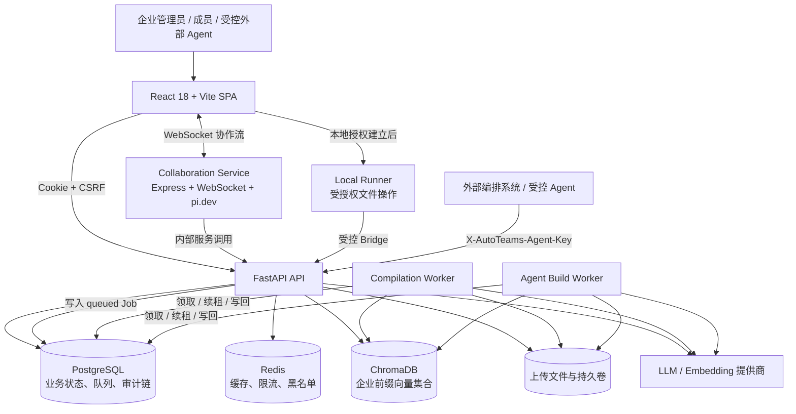
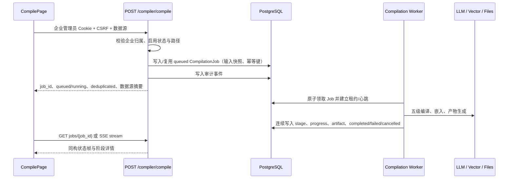
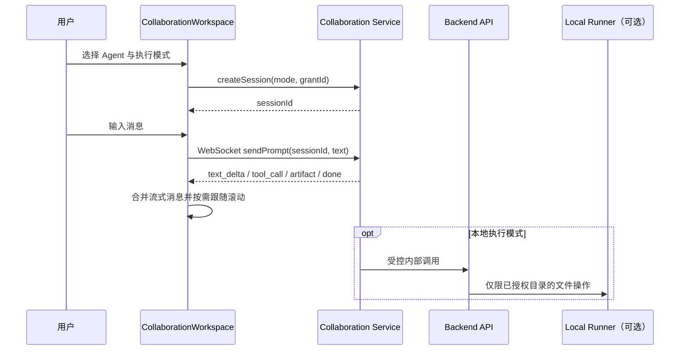
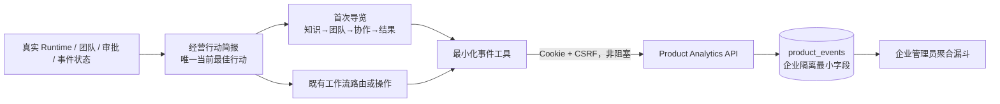

# AutoTeams 技术架构与运行边界

> **文档版本**：v1.0  
> **维护基线**：`main` / `6858cb4 feat-third-round-workflow-resilience-ux`  
> **更新日期**：2026-08-22  
> **适用对象**：后端、前端、协作服务、运维、安全审计与产品集成团队。

## 1. 文档定位

本文是 AutoTeams 当前实现的**运行架构基线**，用于回答系统由哪些可部署单元组成、关键状态由谁持有、异步任务如何恢复、外部 Agent 能调用什么，以及哪些能力仍属于明确的运行边界。它以 `main` 分支代码、部署编排和已执行回归为准；早期 v3 规划文档仍可用于理解领域模型，但不能替代本文对当前运行语义的说明。[1] [2]

> **架构原则**：浏览器请求不承载长任务执行；持久化任务、企业隔离、最小权限和可追踪状态优先于“单次请求看起来立即完成”。

| 架构目标 | 当前实现决策 | 对用户或运维的含义 |
|---|---|---|
| 长任务可靠性 | 五级编译和 Agent 构建由独立 Worker 从数据库领取任务 | Web/API 重启不会直接丢弃已提交任务；UI 可重新进入页面继续查看状态 |
| 多租户隔离 | 数据库资源、向量集合、机器凭证和 API 查询均以企业归属约束 | 外部参数不能越过企业边界读取 Agent、任务或知识数据 |
| 安全收敛 | Local Runner 仅提供受授权根目录内的文件操作；对外 API 不公开文件写删、Shell、CLI 或 Agentic 执行 | 本地和外部调用能力不会因“方便集成”绕过安全边界 |
| 交互可解释性 | 前端同时支持加载、排队、运行、失败、重试和刷新状态 | 用户可理解“任务正在何处、能否离开、下一步如何恢复” |
| 可观测性 | `X-Request-Id`、结构化日志、Prometheus 指标、健康检查和可选 Sentry | 前端报错、后端日志与服务指标可按请求关联排障 |

## 2. 运行拓扑

部署编排定义了前端、后端、两个独立 Worker、协作服务、PostgreSQL、Redis 与 ChromaDB，并为上传、LangGraph 检查点和协作会话状态配置持久卷。[2] 因此，API 服务、编译 Worker 和 Agent 构建 Worker 可以分别重启或扩展；它们通过数据库中的任务记录协作，而不是依赖同一 HTTP 请求或进程内内存。

| 单元 | 主要职责 | 关键状态来源 | 不应承担的职责 |
|---|---|---|---|
| `frontend` | 页面工作流、状态展示、会话交互、请求重试和可访问性反馈 | 后端 API、协作 WebSocket | 执行长时间编译、保存机器密钥或承担企业授权判断 |
| `backend` | 认证、企业授权、API 契约、任务入队、业务读写、审计与健康检查 | PostgreSQL、Redis、ChromaDB、配置 | 在 HTTP 生命周期内同步执行完整编译或 Agent 构建 |
| `compilation-worker` | 领取耐久编译任务、续租、处理取消、写入进度/产物/结果 | `compilation_jobs`、`compilation_artifacts` | 直接信任浏览器路径或绕过企业归属检查 |
| `agent-build-worker` | 领取耐久 Agent 构建任务、执行 LangGraph/向量化与 HITL 恢复 | `agent_build_tasks`、相关 Agent/知识状态 | 以“部分向量写入失败”为成功完成 |
| `collaboration-service` | 管理协作会话、消息流、工具轨迹和持久化会话历史 | 协作状态卷、后端内部 API | 宣称服务重启后可无损恢复模型生成中的会话 |
| `local-runner` | 在用户已授权目录内执行 `list/read/write/delete` | 授权范围与受控桥接 | 执行 Shell、CLI、任意命令或 Agentic 本地协议 |

## 3. API 入口、安全中间件与诊断链

FastAPI 的应用入口以 `/api/v1` 挂载认证、企业、文件、编译、运行时、Workforce、进化、协作、本地路径、LLM 配置与受限 Agent API 等路由。[3] 请求依次受到以下通用机制约束。

| 层 | 实现 | 运行语义 |
|---|---|---|
| CORS | 明确的 `CORS_ALLOWED_ORIGINS`，允许携带 Cookie 但不使用通配符来源 | 防止 `allow_credentials=true` 与任意来源组合产生跨域安全缺口 |
| CSRF | Double Submit Cookie；浏览器状态变更请求携带 `X-CSRF-Token` | 登录、注册等首次认证入口例外；机器凭证路径独立于浏览器 Cookie 认证 |
| 身份与权限 | 浏览器 Cookie/JWT 与企业/角色校验；外部调用使用独立机器凭证 | 管理员、企业成员和机器调用方不会共用一个认证边界 |
| 追踪 | 请求中间件生成或继承 `X-Request-Id`，并将其返回给调用方 | 前端报错、日志和可选 Sentry 事件可围绕同一个请求标识关联 |
| 可观测性 | Prometheus 请求计数与延迟直方图使用路由模板低基数标签；`/health` 探测依赖状态 | 指标不会因 UUID 等高基数路径污染；生产 `/metrics` 可配置 token 保护 |
| 响应安全 | 非静态 API 默认 `no-store`；移除 `Server` 响应头；全局异常返回统一响应体 | 降低共享设备缓存泄露和服务器指纹暴露风险 |

## 4. 关键调用链

### 4.1 五级编译：提交、排队、执行与恢复

编译 API 先校验企业管理员身份和企业启用状态，再校验或选择数据源。它将输入快照与幂等键写入 `CompilationJob`，以 `queued` 状态立即返回 `job_id`；同一企业、同一输入的活跃任务会复用，而非因双击、网络重试或多副本同时提交而重复执行。[4]

前端当前以轮询作为稳定降级路径，并在任务创建、排队、阶段运行、短暂同步失败和立即重试之间保持连续反馈。后端同时提供 SSE 进度流，事件结构与任务详情同构，因此未来可将页面逐步切换为推流而不改变任务状态契约。[4] [5]

| 状态 | 含义 | 页面行为 | 运维语义 |
|---|---|---|---|
| `queued` | 已持久化，等待 Worker 领取 | 显示“等待执行”，允许离开页面 | Worker 不可用时应优先检查其健康和日志 |
| `running` | 已领取且租约/心跳有效 | 显示真实进度和当前阶段 | 重启后可按租约恢复或重新入队 |
| `completed` | 产物与结果已提交 | 刷新完成度、Runtime、Agent/流程指标 | 可进入结果验证与后续 Workforce 流程 |
| `failed` | 任务有受控失败原因 | 显示阶段和错误信息，提供可理解的重试路径 | 保留错误与审计，不把失败伪装为完成 |
| `cancelled` | 已请求并完成取消 | 停止轮询，显示取消结论 | 不应继续被 Worker 领取 |

### 4.2 协作工作台：会话、流式消息与本地模式

协作工作台通过协作服务创建/恢复会话，再通过 WebSocket 发送提示词与接收流式文本、工具调用轨迹、推理步骤和交付物。会话元数据、消息和工作目录写入专用状态卷；服务启动时仍在运行的会话会被保守地标记为 `interrupted`，不会承诺模型生成可无损续传。[6]

第三轮体验优化在前端加入会话加载版本号、会话列表最新请求优先、删除进行中状态和显式错误重试。快速切换会话时，晚到的历史消息响应会被丢弃，避免旧会话覆盖新会话。流式消息滚动通过动画帧合并，且仅在用户停留于底部时跟随新增内容，避免阅读历史时被强制拉回底部。[7]

### 4.3 外部 Agent 集成：主线 REST 与实验 MCP

主线采用受限 REST Agent API：企业管理员通过浏览器会话管理凭证，机器侧仅以 `X-AutoTeams-Agent-Key` 调用被 scope 和可选 Agent allow-list 限制的读取、受授权对话和任务状态接口。完整密钥只在创建时返回一次，服务端保存 HMAC 摘要；认证时再次检查凭证、企业和账户状态。[8] 

MCP JSON-RPC 工具适配层保留在 `feat/mcp-agent-gateway` 独立实验分支。当前静态机器密钥模型仅适用于受控内部环境；在具备 OAuth/OIDC 资源服务器、受众校验、用户委托和撤销链路之前，不能作为公网多用户 MCP 入口。[9]

| 调用面 | 已开放 | 明确未开放 |
|---|---|---|
| 主线 REST Agent API | Agent 发现/查询、受授权 Agent 对话、编译状态读取、构建状态读取 | 编译提交、构建恢复、审批、人类接管、本地路径授权、文件写删、Shell、CLI、Agentic 本地执行 |
| MCP 实验分支 | 与受限 REST 能力等价的读取、对话和任务读取工具 | OAuth/OIDC 公网授权、多用户委托、任意写操作与本地执行 |
| 浏览器应用 | 经过 Cookie、CSRF、企业/角色校验的业务操作 | 绕过企业归属、绕过审计或直接持有机器凭证明文 |

## 5. 状态归属、持久化与恢复边界

| 状态类别 | 权威存储 | 恢复策略 | 已知边界 |
|---|---|---|---|
| 编译任务与产物 | PostgreSQL `compilation_jobs` / `compilation_artifacts` | 依据租约、心跳、状态与输入快照恢复或明确失败 | 真实生产恢复仍应通过 staging 演练验证 |
| Agent 构建 | PostgreSQL `agent_build_tasks` 与关联状态 | 独立 Worker 领取，支持 HITL 暂停/恢复语义 | 前端需始终以任务状态查询为准 |
| 审计链 | PostgreSQL `audit_chain_state` 与审计记录 | 行锁推进链尾；拓扑验证检测分叉、孤儿链和尾指针不一致 | 生产必须配置独立强随机签名密钥 |
| RAG 向量 | ChromaDB 企业前缀集合 | 新写入按企业隔离；旧集合双读兼容并可回填 | 旧集合清理前应验证回填覆盖和检索质量 |
| 协作会话 | 协作服务状态卷 | 原子写、同进程串行化与跨进程目录锁 | 高并发、跨可用区或不共享文件系统时应迁移至数据库/Redis 事务存储 |
| 浏览器会话 | HttpOnly Cookie + Refresh 机制 | 401 时前端合并刷新请求并重试 | 前端不保存访问令牌或用户对象作为权限事实来源 |

## 6. 安全边界与不可放宽项

以下边界是审计整改的核心结论，任何后续产品扩展都应经过新的威胁建模、权限设计和回归验证，而不能通过删除限制“快速恢复功能”。

| 边界 | 当前约束 | 变更前必须完成的工作 |
|---|---|---|
| Local Runner | 仅 `list/read/write/delete`，并且所有路径受授权根目录限制 | 针对新增能力建立最小权限模型、输入校验、审计事件和独立安全测试 |
| 企业向量隔离 | 使用 `ent_{enterprise_id}_agent_{agent_id}` 前缀；写入失败上抛至任务失败 | 新增检索/写入路径必须显式传入企业归属并覆盖异常传播测试 |
| 对外 Agent API | 独立机器凭证、scope、allow-list、企业过滤与审计 | 写操作需补幂等键、成本预算、审批/回调语义与安全审计 |
| 人工接管 | 当前稳定返回 `501`，不把未实现能力伪装为成功 | 补齐任务移交、权限、人工工作台、审计、恢复与回滚流程后方可开放 |
| 审计签名 | `AUDIT_SIGNING_KEY` 与 `AGENT_API_KEY_HMAC_SECRET` 应为不同的强随机生产密钥 | 接入密钥管理、轮换、预发布验证和泄露应急流程 |

## 7. 运维与验证基线

后端启动只进行数据库连接校验，Schema 迁移必须通过 Alembic 显式执行；健康检查会探测数据库、Redis 和 ChromaDB，状态可为 `healthy`、`degraded` 或 `unhealthy`。[3] 生产发布不应仅依赖本地开发验证，应至少完成下表流程。

| 阶段 | 必做动作 | 成功判据 |
|---|---|---|
| 依赖与迁移 | 依据带哈希 `requirements.lock` 建立环境，执行 `alembic upgrade head` | 依赖与迁移版本一致，且可在 staging 验证 rollback |
| 服务启动 | 启动 backend、compilation-worker、agent-build-worker、collaboration-service | 健康检查正常，Worker 输出领取/心跳日志，协作服务状态卷可写 |
| 安全配置 | 配置 CORS 来源、独立审计/Agent API 密钥、Metrics token 与生产 Bridge secret | 无默认/回退密钥告警；无开放跨域或未授权指标入口 |
| 关键回归 | 前端 lint/build、协作服务 typecheck、Local Runner 安全测试、后端目标单元测试 | 所有命令通过；仅记录并治理非阻断弃用告警 |
| 运行演练 | 任务失租重领、Worker 重启、会话重启、RAG 回填、Agent API 跨企业拒绝 | 状态可查询、失败可解释、审计链可验证、无越权读取 |

## 8. 与历史文档的关系

| 文档 | 职责说明 |
|---|---|
| `DEPLOY.md` | 生产环境 Docker 容器编排、环境变量配置与安全基线 |
| `AGENT_API.md` | 外部开发者 REST 使用手册与机器凭证规范 |
| `API_v3.md` | 核心系统接口契约与数据结构字典 |

## References

[1]: [docker-compose.yml](../docker-compose.yml)  
[2]: [backend/app/main.py](../backend/app/main.py)  
[3]: [AGENT_API.md](./AGENT_API.md)  
[4]: [DEPLOY.md](./DEPLOY.md)  
[5]: [API_v3.md](./API_v3.md)

## 9. 经营行动简报、首次导览与产品体验分析补充

默认 `/company` 总览增加“经营行动简报”：它不是新的业务状态源，而是对已存在的 Runtime、AI 员工、审批、失败事件和协作事件进行**确定性前端归纳**，将当前企业映射到“建立运行底座、组建团队、处理审批、处理异常、启动首条协作链路、验证业务效果”之一。CTA 继续调用既有页面路由或既有协作 API，不改变企业授权、任务队列或审批语义。

首次导览是前端嵌入式、可跳过的四步价值叙事。浏览器只在 `localStorage` 保存 `completed` 或 `dismissed` 的非敏感偏好；它不写入用户档案、不阻塞当前工作流，并在 `prefers-reduced-motion` 下关闭位移动效。

产品体验事件使用独立 `product_events` 表，不能替代带 HMAC 链的安全审计日志。写入 API 只接收白名单事件名、旅程状态、CTA 枚举、导览步骤、随机浏览器会话标识和减少动效偏好；它拒绝自由文本、资源 ID、路径、提示词与业务正文。事件写入要求已认证企业用户，聚合查询只对所属企业管理员开放，且只返回会话级计数与分布，不提供用户级行为明细。
